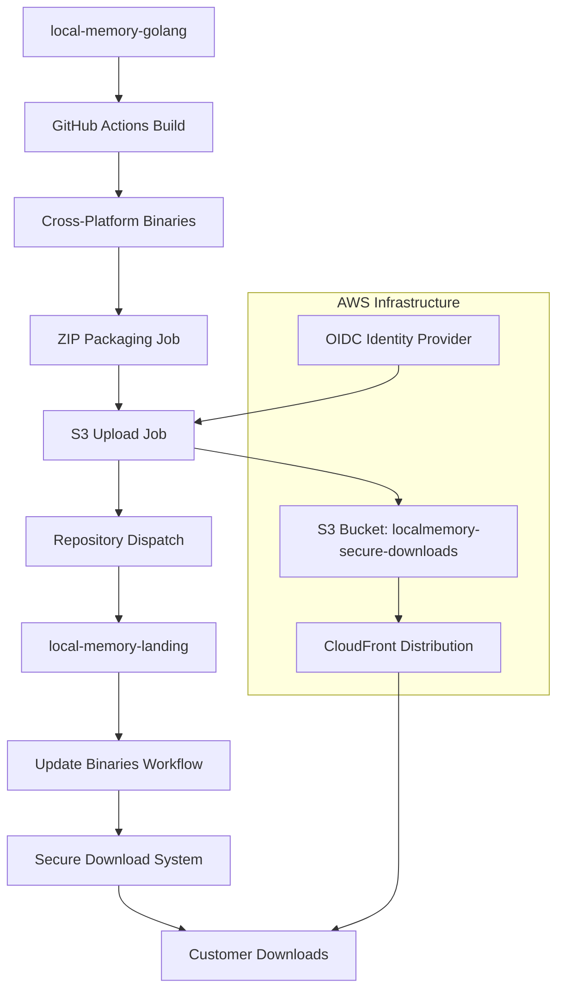

# Cross-Repository Integration Documentation

## Overview

This document describes the automated integration between the `local-memory-golang` and `local-memory-landing` repositories, enabling seamless binary distribution through GitHub Actions workflows.

## Architecture



## Repository Structure

### local-memory-golang (Source Repository)
- **Primary Function**: Build cross-platform binaries and package them for distribution
- **Key File**: `.github/workflows/cross-platform.yml`
- **Triggers**: Push to `main`, tags starting with `v*`
- **Outputs**: ZIP packages uploaded to S3, repository dispatch to landing page

### local-memory-landing (Target Repository)  
- **Primary Function**: Provides secure download interface and license key generation
- **Key File**: `.github/workflows/validate-license-keys.yml`
- **Triggers**: Direct pushes to Success.tsx or license key related files
- **Outputs**: Customer-facing download page with license key generation

## Workflow Dependencies

### 1. GitHub Actions Workflow (local-memory-golang)

**File**: `/.github/workflows/cross-platform.yml`

**Jobs and Dependencies**:
```yaml
build → package-zips → validate-license-keys → [upload-to-s3, notify-landing-page]
                                          ↓
test-linux ← build
test-macos ← build  
test-windows ← build
integration-test ← build
release ← [build, package-zips, test-linux, test-macos, test-windows, integration-test, validate-license-keys]
```

**Key Jobs**:
- **`build`**: Creates platform-specific binaries with aligned naming conventions
- **`package-zips`**: Packages binaries into universal ZIP file with README instructions
- **`validate-license-keys`**: Validates frontend license key generation before deployment
- **`upload-to-s3`**: Uploads universal ZIP package to secure download bucket
- **`notify-landing-page`**: Sends repository dispatch to landing page (notification only)
- **`release`**: Creates GitHub releases with all assets

### 2. License Key Validation Workflow (local-memory-landing)

**File**: `/.github/workflows/validate-license-keys.yml`

**Jobs and Dependencies**:
```yaml
validate-license-keys → (test success)
```

**Key Jobs**:
- **`validate-license-keys`**: Validates frontend license key generation algorithm
  - Tests format validation (length, pattern, character set)
  - Tests cryptographic validation (using golang binary)  
  - Tests deterministic generation (same inputs = same outputs)
  - Blocks deployments if validation fails

**Note**: The binary distribution is now handled entirely by the golang workflow. This workflow only validates that the landing page generates valid license keys.

## Security Configuration

### GitHub Secrets (local-memory-golang)

| Secret Name | Purpose | Required For |
|-------------|---------|--------------|
| `CROSS_REPO_PAT` | Repository dispatch authentication | Repository communication |
| `AWS_ROLE_TO_ASSUME` | AWS OIDC role ARN | S3 uploads |
| `DOWNLOAD_SECRET` | Hash generation for secure URLs | Time-windowed URL security |

### GitHub Secrets (local-memory-landing)

| Secret Name | Purpose | Required For |
|-------------|---------|--------------|
| `GITHUB_TOKEN` | Standard GitHub token | Repository operations |

### AWS Configuration

**S3 Bucket**: `localmemory-secure-downloads`
- **Purpose**: Secure storage for time-windowed binary downloads
- **Access**: Restricted via CloudFront Origin Access Identity (OAI)
- **Structure**: `downloads/{time_window}/{hash}/{platform}/{filename}`

**CloudFront Distribution**: `d3g3vv5lpyh0pb.cloudfront.net`
- **Purpose**: CDN for secure binary distribution
- **Origin**: S3 bucket with `/downloads` origin path
- **Security**: Restricted S3 access, public CloudFront access

**OIDC Configuration**:
```json
{
  "Version": "2012-10-17",
  "Statement": [
    {
      "Effect": "Allow",
      "Principal": {
        "Federated": "arn:aws:iam::ACCOUNT:oidc-provider/token.actions.githubusercontent.com"
      },
      "Action": "sts:AssumeRole",
      "Condition": {
        "StringEquals": {
          "token.actions.githubusercontent.com:aud": "sts.amazonaws.com",
          "token.actions.githubusercontent.com:sub": [
            "repo:danieleugenewilliams/local-memory-golang:ref:refs/heads/main"
          ]
        }
      }
    }
  ]
}
```

## Binary Distribution Flow

### 1. Build Trigger
- **Event**: Push to `main` or tag creation in `local-memory-golang`
- **Action**: GitHub Actions workflow starts cross-platform build

### 2. Binary Creation
- **Platforms**: Linux (x64), macOS (Intel + ARM), Windows (x64)
- **Output Names**: 
  - `local-memory-linux`
  - `local-memory-macos-intel` 
  - `local-memory-macos-arm`
  - `local-memory-windows.exe`

### 3. ZIP Packaging
- **macOS ZIP**: Contains both Intel and ARM binaries + README
- **Windows ZIP**: Contains Windows executable + README  
- **Linux ZIP**: Contains Linux binary + README
- **Validation**: Integrity checks, size validation, content verification

### 4. S3 Upload
- **Time Windows**: Current window + next window (12-hour intervals)
- **Hash Generation**: `SHA256(SECRET:download-access:TIME_WINDOW:PLATFORM)[0:16]`
- **Upload Path**: `downloads/{window}/{hash}/{platform}/{filename}`
- **Retry Logic**: 3 attempts with exponential backoff
- **Verification**: File existence, metadata validation, URL testing

### 5. Repository Dispatch
- **Target**: `local-memory-landing` repository
- **Event Type**: `binaries-updated`
- **Payload**: Build metadata, artifact lists, URLs

### 6. Landing Page Update
- **Trigger**: Repository dispatch received
- **Action**: Download ZIP packages, update local binaries, run upload script
- **Result**: Secure download URLs updated for customer access

## File Dependencies

### Critical Files (local-memory-golang)
- `.github/workflows/cross-platform.yml` - Main automation workflow
- `scripts/build-all-platforms.sh` - Local build script (reference)
- `cmd/server/main.go` - Binary entry point

### Critical Files (local-memory-landing)
- `.github/workflows/validate-license-keys.yml` - License key validation workflow
- `test-license-key-validation.js` - Cross-platform license key testing
- `src/pages/Success.tsx` - Download page with license key generation
- `CLAUDE.md` - Project configuration and environment variables

### Configuration Files
- `cloudfront-config.json` - CloudFront distribution settings
- `s3-bucket-policy.json` - S3 security configuration

## Time-Windowed Security System

### Hash Generation Algorithm
```bash
SECRET="d9e7e7a9f2b40547a5a0d6a99fc0ae8bf6847a700f7928f7f82a7f4b3223bf84"
TIME_WINDOW=$(date +%s | awk '{print int($1/43200)}')  # 12-hour windows
PLATFORM="macos|windows|linux"

DATA="${SECRET}:download-access:${TIME_WINDOW}:${PLATFORM}"
HASH=$(echo -n "$DATA" | openssl dgst -sha256 | cut -d' ' -f2 | cut -c1-16)
```

### URL Structure
```
Frontend URL:    https://localmemory.co/downloads/{window}/{hash}/{platform}/{filename}
CloudFront URL:  https://d3g3vv5lpyh0pb.cloudfront.net/{window}/{hash}/{platform}/{filename}
S3 Key:         downloads/{window}/{hash}/{platform}/{filename}
```

### Security Features
- **Time-Limited**: URLs expire after 48 hours
- **Cryptographically Secure**: SHA256-based hash prevents enumeration
- **Platform-Specific**: Each platform has unique URL path
- **Session-Bound**: URLs tied to specific Stripe payment sessions

## Error Handling & Recovery

### Common Failure Scenarios

1. **S3 Upload Failure**
   - **Detection**: Upload verification step fails
   - **Recovery**: Manual re-run of golang workflow or upload script
   - **Prevention**: Retry logic with exponential backoff

2. **Repository Dispatch Failure**
   - **Detection**: Landing page workflow not triggered
   - **Recovery**: Manual workflow dispatch on landing page
   - **Prevention**: PAT token validation, payload verification

3. **Binary Build Failure**
   - **Detection**: Build job fails in golang workflow
   - **Recovery**: Fix build issues and re-push/re-tag
   - **Prevention**: Comprehensive testing matrix

4. **CloudFront Propagation Delay**
   - **Detection**: URLs return 403/404 immediately after upload
   - **Recovery**: Wait 5-15 minutes for propagation
   - **Prevention**: Upload to multiple time windows

### Manual Recovery Procedures

**Re-upload Binaries**:
```bash
cd /path/to/local-memory-landing
./upload-secure-downloads.sh upload
```

**Force Landing Page Update**:
1. Go to: https://github.com/danieleugenewilliams/local-memory-landing/actions
2. Select "Update Binary Downloads" workflow
3. Click "Run workflow" → "Force update binaries" → Run

**Verify Download System**:
```bash
cd /path/to/local-memory-landing  
./upload-secure-downloads.sh verify
./upload-secure-downloads.sh window  # Check current time window
```

## Maintenance Tasks

### Regular Tasks
- **Weekly**: Verify download system health
- **Monthly**: Rotate GitHub PAT tokens
- **Quarterly**: Review and update AWS IAM policies

### Monitoring Commands
```bash
# Check current time window
./upload-secure-downloads.sh window

# Verify uploads exist
./upload-secure-downloads.sh verify

# Check S3 bucket contents  
aws s3 ls s3://localmemory-secure-downloads/downloads/ --recursive

# Test CloudFront access
curl -I https://d3g3vv5lpyh0pb.cloudfront.net/{path}
```

### Cleanup Tasks
```bash
# Clean old time windows (automated in upload script)
./upload-secure-downloads.sh cleanup

# Remove old GitHub Actions artifacts (automated - 30 day retention)
```

## Troubleshooting Guide

### Issue: Download URLs Return 403
**Causes**: S3 upload failed, CloudFront propagation delay, incorrect hash generation
**Solutions**: 
1. Check S3 bucket for files: `aws s3 ls s3://localmemory-secure-downloads/downloads/`
2. Verify time window calculation
3. Wait 15 minutes for CloudFront propagation
4. Re-run upload script: `./upload-secure-downloads.sh upload`

### Issue: Repository Dispatch Not Working
**Causes**: Invalid PAT token, incorrect repository name, payload validation failure
**Solutions**:
1. Verify PAT token has `repo` scope
2. Check repository name in workflow file
3. Validate payload structure in landing page workflow logs

### Issue: Binary Build Failures
**Causes**: Go compilation errors, missing dependencies, platform-specific issues
**Solutions**:
1. Check build logs in golang repository Actions
2. Verify Go version compatibility (1.23)
3. Test local builds with `scripts/build-all-platforms.sh`

## Future Enhancements

### Planned Improvements
1. **Artifact Download**: Implement actual GitHub API artifact download in landing page workflow
2. **Health Monitoring**: Add automated health checks and alerting
3. **Rollback System**: Implement automated rollback on failure
4. **Metrics Collection**: Add usage and performance metrics
5. **Multi-Environment Support**: Separate staging and production environments

### Security Enhancements  
1. **Binary Signing**: Code signing for macOS and Windows binaries
2. **Checksum Verification**: SHA256 checksum validation for downloads
3. **Rate Limiting**: CloudFront rate limiting for download URLs
4. **Access Logging**: Detailed audit logs for download access

This integration provides a robust, secure, and automated binary distribution system that maintains the existing security model while enabling seamless updates across repositories.